# Login

1. Nhập email + password để đăng nhập và thực hiện các quyền

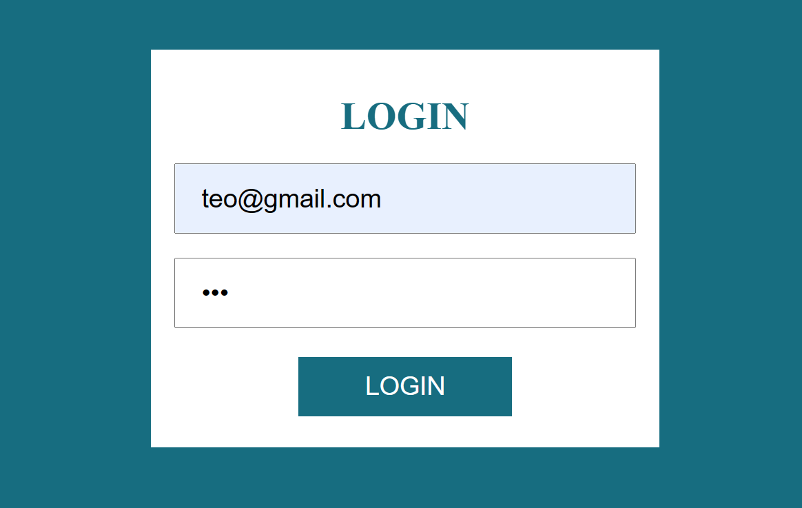

# User
2.1. Nếu là user sẽ hiện thông tin và role của user đó

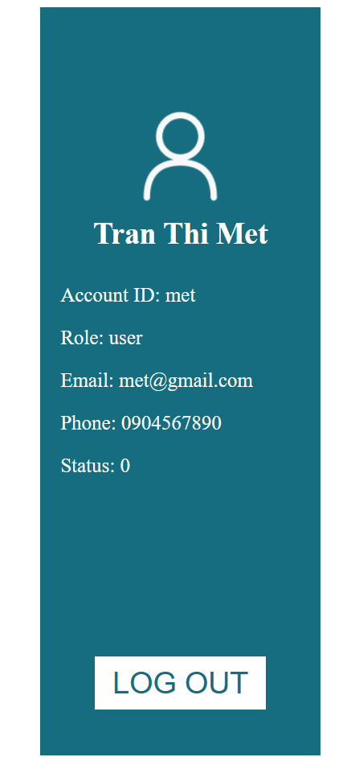

# Admin

2.2 Nếu là admin sẽ hiển thị các thao tác xử lý

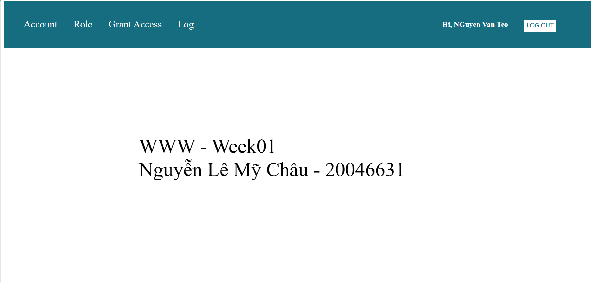

3. Click vào từng chức năng để thao tác

# Account

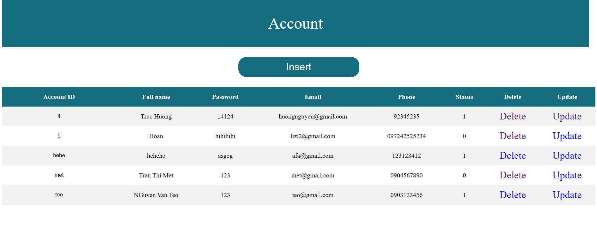

4. Thực hiện nhập thông tin và nhấn button Add -> Đưa dữ liệu xuống database
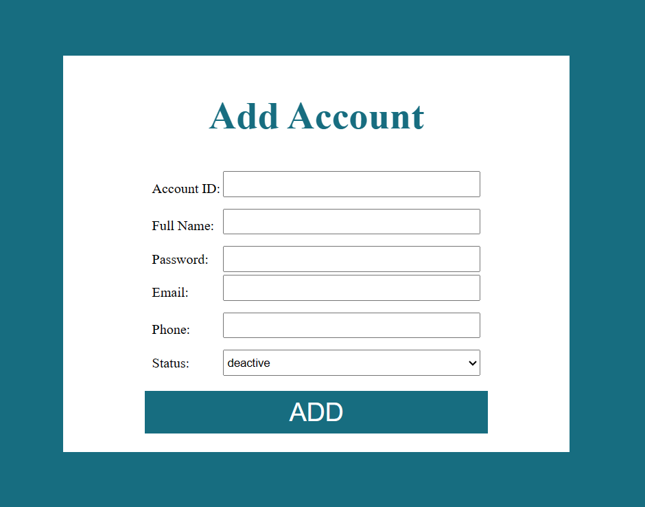

5. Khi nhấn delete ở một row -> Lấy account_id của row đó -> setStatus = 0

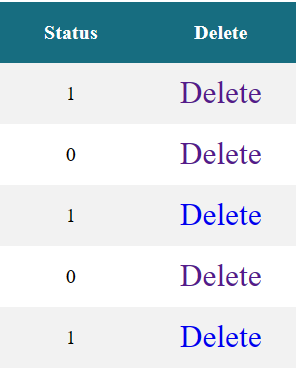

6. Khi nhấn update

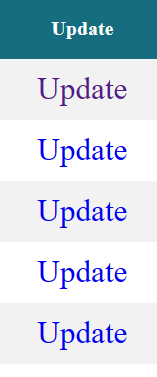

Lấy account_id của row đã chọn gán mặc định cho ô và để chế độ readonly -> Sau khi nhập thông tin cần đổi nhấn Update

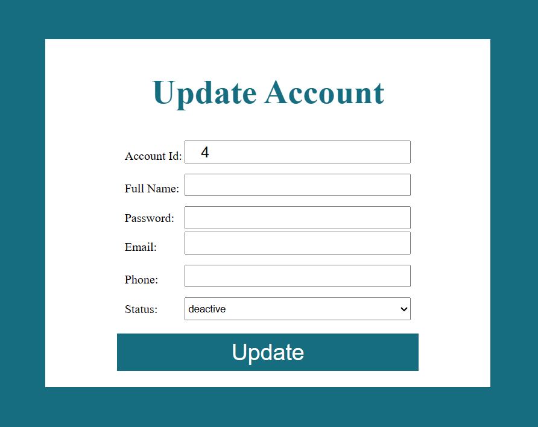

# Role
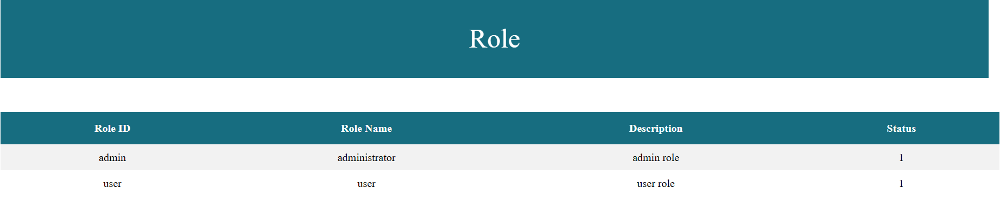

# Grant Access
7. Mặc định là hiển thị danh sách account có role là user. Nếu muốn thay đổi -> Chọn select option mong muốn và nhấn Change
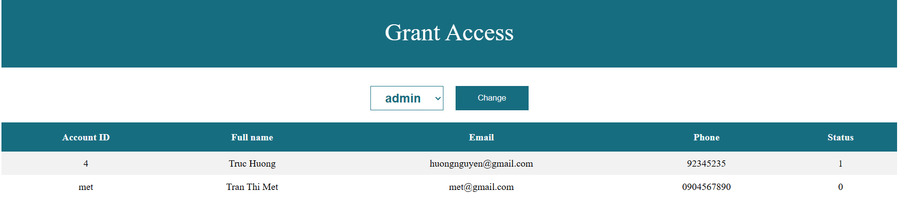

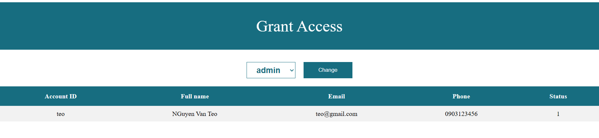

# Logs
Danh sách tất cả account đã login và logout
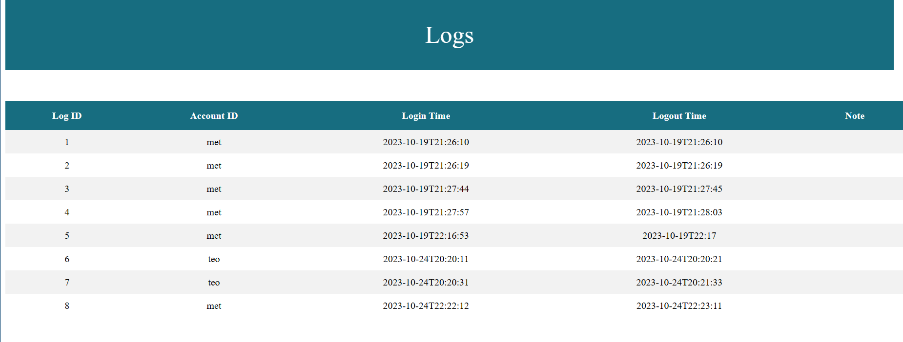

# Logout

Khi nhấn LogOut -> Quay về trang Login và đưa dữ liệu xuống database
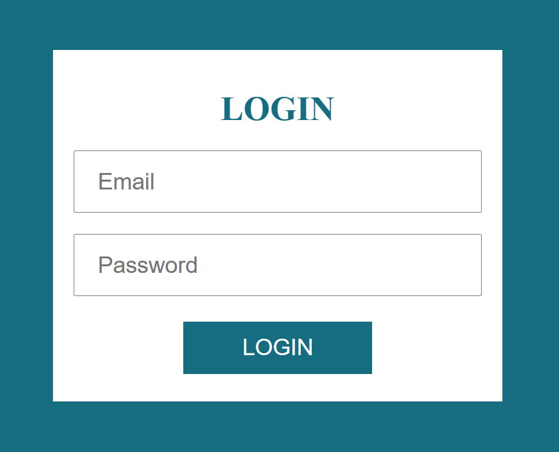

Lần đăng nhập thực hiện mới đây
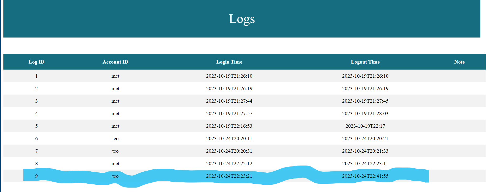